# EC Services

## Overview

EC service is where the business logic glues the HAL + common EC functional traits + EC peripheral driver together.

## Building Blocks

### MCU Platform HAL

Hardware specific HAL leveraging Rust Async framework

- Must implement embedded-hal traits to allow a generic hardware agnostic interface
- Desire is for HALs to be open-sourced and upstreamed to Embassy main repo
- Plan to partner with MCU vendor to support more MCU in the future

For example, [embassy-imxrt](https://github.com/pop-project/embassy-imxrt)

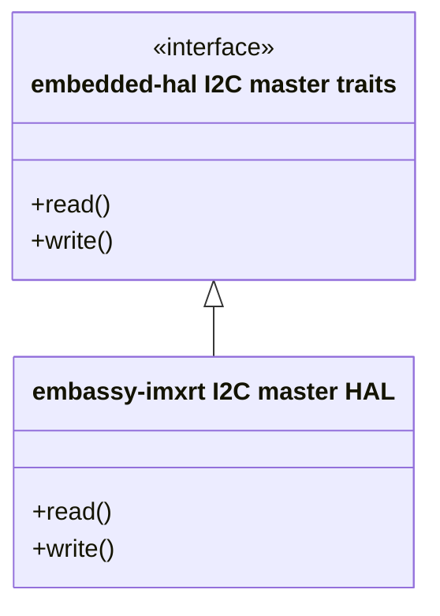

### EC Subsystem Platform Abstractions

There are sets of generic Rust traits the define an EC functional subsystem like thermal, USB PD, fan, battery. This abstraction serves to abstract the underlying HW design away from the business logic.

For example, [embedded-sensor](https://github.com/pop-project/embedded-sensors)

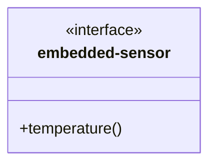

### Rust Based Drivers for EC Peripherals

There are MCU platform agnostic Rust drivers for specific HW parts connected to the EC like TMP108 temp sensor.

- Depending on embedded-hal interface so it is talking to a generic HW interface, not tying to any specific MCU platform
- Implements a EC function platform abstraction traits like `embedded-sensor`, `embedded-battery`, `embedded-fan`
- Plan to partner with vendor to open-source these drivers

For example, [tmp108](https://github.com/pop-project/tmp108)

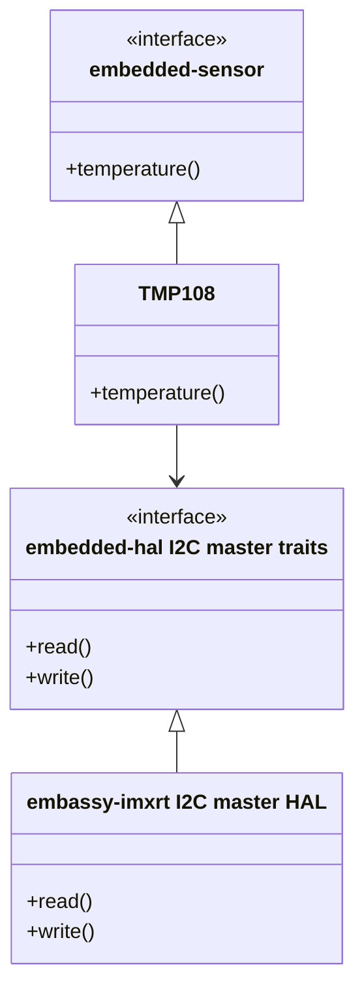

## EC Services Repo

EC service houses the business logic that glues the EC peripheral Rust driver + EC subsystem platform abstraction + MC platform HAL together/.

## Repo Organization

- embedded-services repo
  - embedded-services library crate
    - service traits
    - intrusive-list
    - transport/router
- power-button-service
  - library crate
- hid-service
  - library crate

### embedded-services

This houses common EC service utilities to build a service. It includes:

- instrusive-list that allows dynamic number of subscribers and publishers for a service
- transport (IPC) logic that allows EC services to talk to each other

#### transport (IPC)

Protocol agnostric transport allowing dynamic number of endpoints to send and receive message. It makes use of the instrusive list to allow dynamic number of endpoints corresponding to each endpoint ID.

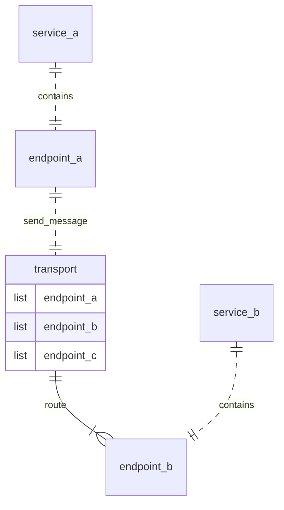

Message are opaque pointer to a Rust object, so it literally can be anything.

### Individual services

Services will be separate crates in this repo. Each service crate will be implementation of the interfaces for a functional area.

The service itself should be hardware/platform agnostic and contains the application logic for EC functionality.

For example, temperature_service

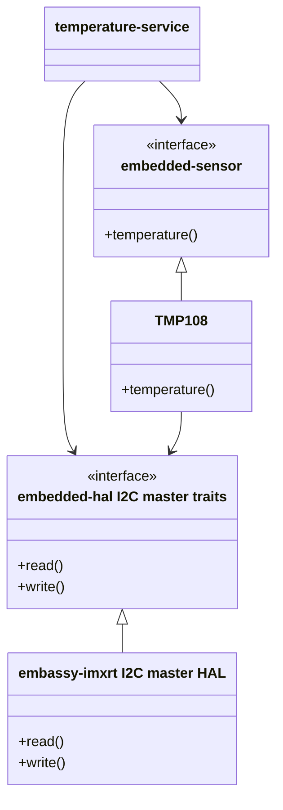

#### hid-service

HID over I2c transport

#### power-button-service

Service to manage a power button

#### espi-service

Provide eSPI transport, similar to traditional x86 EC, a memory map table of information will be maintained.

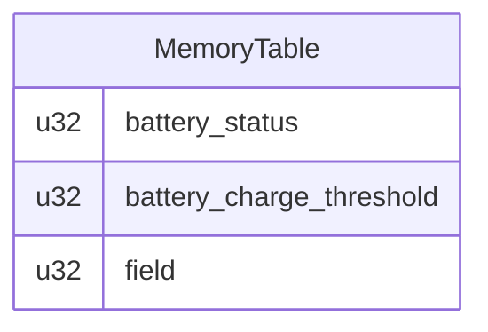

##### read operation

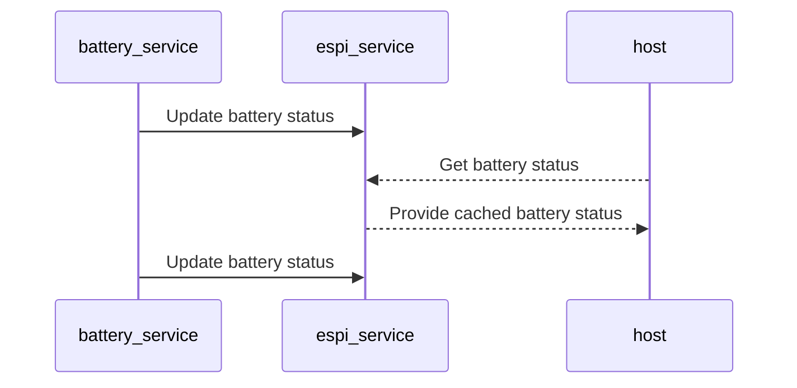

- service register with the espi service for an entry in the table
- service periodically update their table entries by sending a message throught transport to espi_service
- host eSPI peripheral channel read always gets the cached value

##### write operation

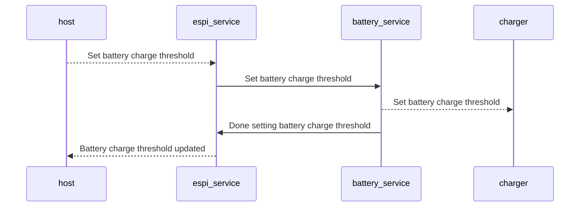

- service register with the espi service for an entry in the table
- host eSPI peripherla channel write opertions triggers espi_service to send message to battery_service to update the charge threshold
- battery service performs the bus operation to update the charge threshold on the charge
- after bus operation is done, battery service notifies espi_service
- espi_service updates the memory table and optionally can notify the host

#### nvm-service (planned)

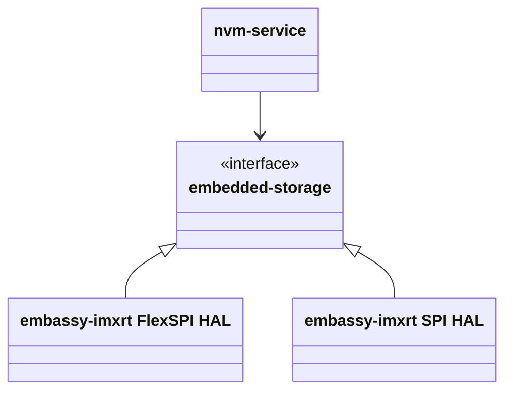

- nvm-service
  - embedded-nvm (generic, would prefer to have filesystem features like error checking and file structures)
    - embedded-storage
      - FlexSPI
      - SPI

## EC Top-Level

At the top-level, a EC is an aggregate of service.

Sets of services can be grouped into subsystem. For instance, thermal subsystem will consist of temperature-service + fan-service + battery-service + debug-service + host-comm-service. The service talks to each other through the transport (IPC) layer. An EC service can also be shared between different subsystems. For instance, debug-service will subcribe to debug messages from other services.

``` Rust
async fn (spawner: Spawner) {
    //initialize HW peripheral and system level managemetn
    spawn(services(periphal, configuration))
    ...
}
```

### Example: Simplified Layer of Subsystem + Services

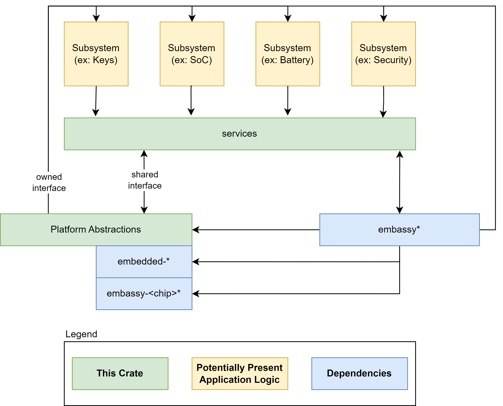

### Example: E2E of Keyboard over eSPI

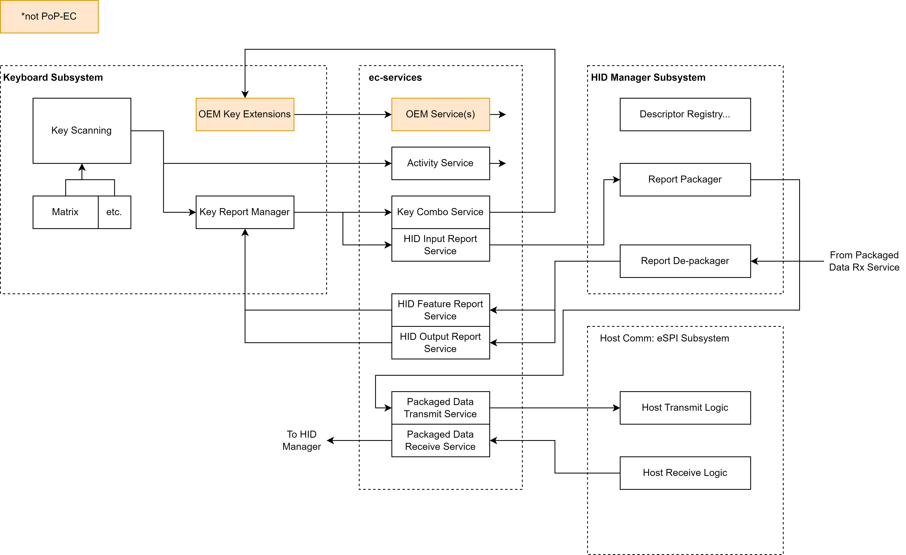
