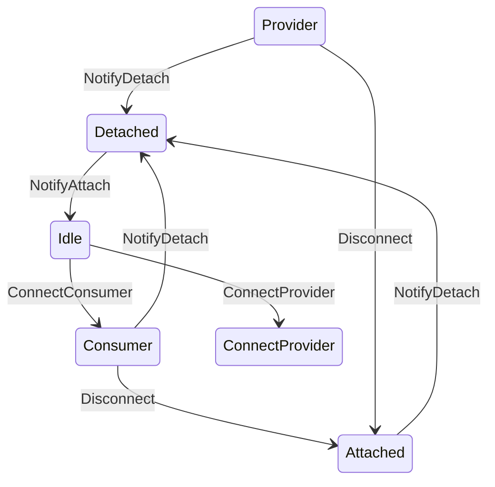

# Power Policy Service

This document provides a high-level overview of the power policy service. This service is focused around a single policy implementation that manages any number of devices. 

## Internal Messaging

### Device State
Each device can be in one of the following states (`device::State`):

* `Detached`: Nothing attached, device cannot provide or consumer power
* `Attached`: The device is attached, but is not currently providing or consumer power
* `Consumer(max power)`: The device is currently consuming power
* `Provider(max power)`: The device is currently providing power

### Policy Messages
These messages are sent from a device to the power policy.

#### `NotifyDetach`
The device is no longer attached and cannot provide or consumer power.

#### `NotifyAttach`
The device is attached, but not providing or consuming power.

#### `NotifyConsumerCapability(max power)`
Informs the power policy of the device's maximum consumer power, the policy may decided to start consuming from this device. `None` indicates that the device is longer capable of acting as a consumer.

#### `RequestProviderCapability(max power)`
Requests the given power to provide.

#### `NotifyDisconnect`
Sent from a device in the `Provider` or `Consumer` states to notify that it is no longer providing or consuming. E.g. a PD source doing a role-swap to consumer.

### Device Messages
These messages are sent from the power policy to a device

#### `ConnectConsumer(max power)`
Directs the device to start consuming power at the specified power. If successfull the device will enter the `Consumer` state.

#### `ConnectProvider(max power)`
Directs the device to start providing power at the specified power. If successfull the device will enter the `Provider` state

#### `Disconnect`
Directs the device to stop providing or consuming and enter the `Attached` state.

### Comms Messages
These messages are used to communicate through the comms serivce.

#### `ConsumerDisconnected(device ID)`
The given device has stopped consuming.

#### `ConsumerConnected(device ID, max power)`
The given device has started consuming at the specified power.