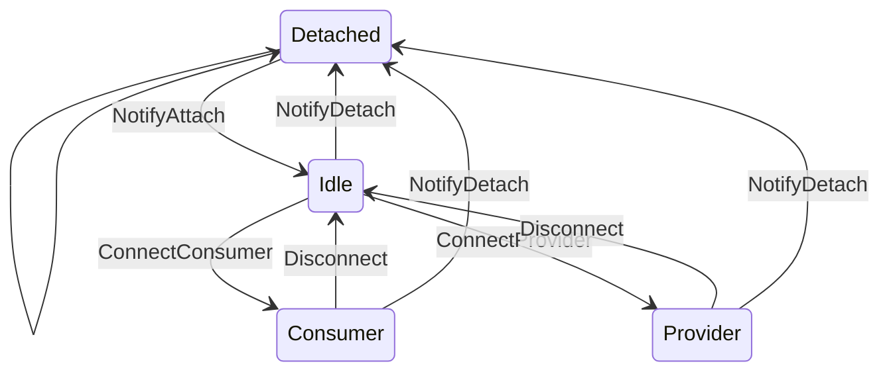

# Power Policy Service

This document provides a high-level overview of the power policy service. Implementations of this service 

## Design
This service is designed around a single policy implementation that manages any number of devices. The `policy::ContextToken` type can only be created once and is meant to allow the policy implementation access to the `policy::Context` type. The context maintains a list of devices. The `device::Device` struct maintains the state of a particular device and allows the policy implementation and a specific device to communicate. Transitioning a device between states is done through type-stated action structs located in the `action` module. `action::Device` contains types where the device state transition is driven from the device itself (e.g. the driver for an external charger detects an unplug event). While `action::Policy` contains types where the device state transition is driven from the policy (e.g. in response to that unplug event the policy directs another device to start consuming power).

## Internal Messaging

### Device State
Each device can be in one of the following states (`device::State`):

* `Detached`: Nothing attached, device cannot provide or consumer power
* `Idle`: The device is attached, but is not currently providing or consumer power
* `Consumer(max power)`: The device is currently consuming power
* `Provider(max power)`: The device is currently providing power

#### Device recovery
Requests to a device can fail for any number of reasons (bus communication issues, deadlock in driver code, etc). In most cases this won't result in any issues as most failed requests result in the system being in a safe state. E.g. a failed transition from `Idle` to `ConnectedConsummer` will result in the system just not drawing power. However, a failed request in the `ConnectedProvider` state can leave the system providing more power than intended. The device state isn't enough to capture this situation as the device must be assumed to still be the in the `ConnectedProvider` state. The `Device` struct contains a `recovery` member to track this situation. The specifics of the recovery process are implementation defined.

### Policy Messages
These messages are sent from a device to the power policy.

#### `NotifyDetach`
The device is no longer attached and cannot provide or consumer power.

#### `NotifyAttach`
The device is attached, but not providing or consuming power.

#### `NotifyConsumerCapability(max power)`
Informs the power policy of the device's maximum consumer power, the policy may decided to start consuming from this device. `None` indicates that the device is longer capable of acting as a consumer.

#### `RequestProviderCapability(max power)`
Requests the given power to provide.

#### `NotifyDisconnect`
Sent from a device in the `Provider` or `Consumer` states to notify that it is no longer providing or consuming. E.g. a PD source doing a role-swap to consumer.

### Device Messages
These messages are sent from the power policy to a device

#### `ConnectConsumer(max power)`
Directs the device to start consuming power at the specified power. If successfull the device will enter the `Consumer` state.

#### `ConnectProvider(max power)`
Directs the device to start providing power at the specified power. If successfull the device will enter the `Provider` state

#### `Disconnect`
Directs the device to stop providing or consuming and enter the `Idle` state.

### Comms Messages
These messages are used to communicate through the comms serivce.

#### `ConsumerDisconnected(device ID)`
The given device has stopped consuming.

#### `ConsumerConnected(device ID, max power)`
The given device has started consuming at the specified power.