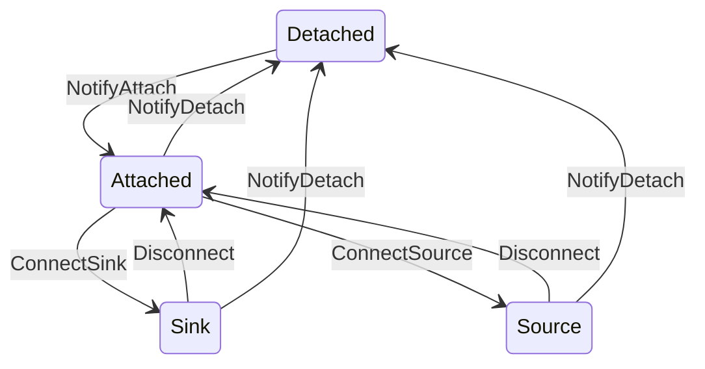

# Power Policy Service

This document provides a high-level overview of the power policy service. This service is focused around a single policy implementation that manages any number of devices. 

## Internal Messaging

### Device State
Each device can be in one of the following states (`device::State`):

* `Detached`: Nothing attached, device cannot source or sink power
* `Attached`: The device is attached, but is not currently sourcing or sinking power
* `Sink(max power)`: The device is currently sinking power
* `Source(max power)`: The device is currently sourcing power

### Policy Messages
These messages are sent from a device to the power policy.

#### `NotifyDetach`
The device is no longer attached and cannot source or sink power.

#### `NotifyAttach`
The device is attached, but not sourcing or sinking power.

#### `NotifySinkPowerCapability(max power)`
Informs the power policy of the device's maximum sink power, the policy may decided to start sinking from this device. `None` indicates that the device is longer capable of acting as a sink.

#### `RequestSourcePowerCapability(max power)`
Requests the given power to source.

#### `NotifyDisconnect`
Sent from a device in the `Source` or `Sink` states to notify that it is no longer sourcing or sinking. E.g. a PD source doing a role-swap to sink.

### Device Messages
These messages are sent from the power policy to a device

#### `ConnectSink(max power)`
Directs the device to start sinking power at the specified power. If successfull the device will enter the `Sink` state.

#### `ConnectSource(max power)`
Directs the device to start sourcing power at the specified power. If successfull the device will enter the `Source` state

#### `Disconnect`
Directs the device to stop sourcing or sinking and enter the `Attached` state.

### Comms Messages
These messages are used to communicate through the comms serivce.

#### `SinkDisconnected(device ID)`
The given device has stopped sinking.

#### `SinkConnected(device ID, max power)`
The given device has started sinking at the specified power.