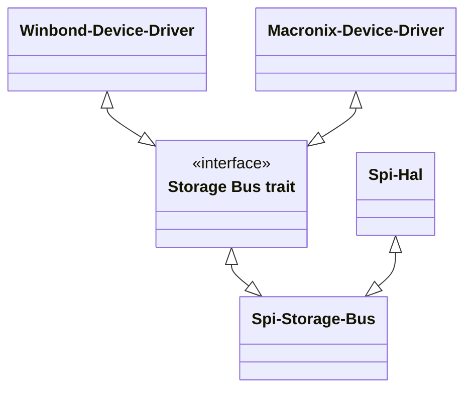

# Introduction
The goal of this design is to propose a generic Storage Bus Driver interface to all flash Device drivers. Flash device drivers such as Macronix or Winbond driver can access storage devices over different kinds of busses. E.g. communication could be through SPI bus or FlexSPI Bus based on platform design. 

Bus drivers introduce abstraction using generic storage traits and expose them to NOR device drivers such as Macronix or Winbond to communicate with the Hardware without worrying about low level bus protocol details. 

Bus driver + generic storage traits can handle other protocol such as I2C or NVMe without any impact to the device drivers. 

# Static Design

## Storage Bus Driver design


## Example
```
/// SPI Bus driver instance 

pub struct SpiNorStorageBus { 
    // Structure Fields 
} 

impl BlockingNorStorageBusDriver for SpiNorStorageBus {
    fn send_command(
        &mut self,
        cmd: NorStorageCmd,
        read_buf: Option<&mut [u8]>,
        write_buf: Option<&[u8]>,
    ) -> Result<(), impl NorStorageBusError> {
        // Handle the storage commands
    }
}
```
